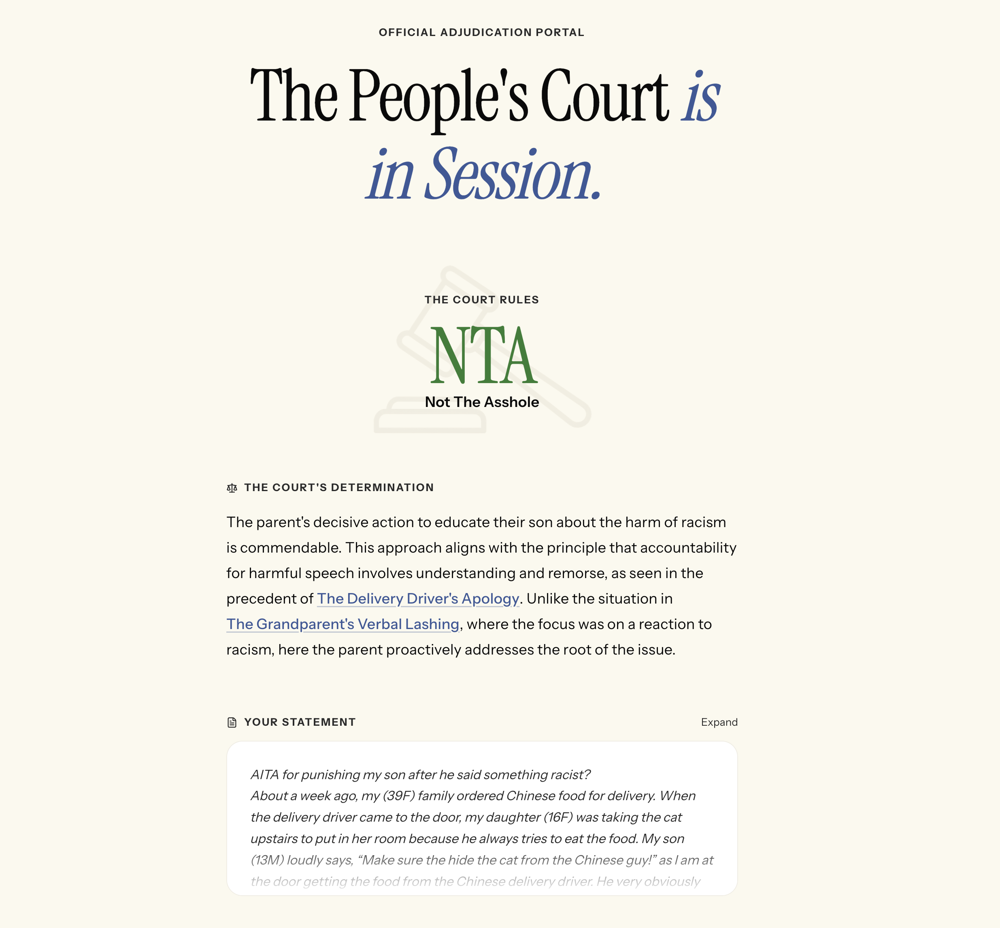

# Am I the Asshole? Let the People's Court decide!

https://peoples-court.vercel.app/

Draw upon case law from a decade of [r/AmITheAsshole](https://www.reddit.com/r/AmItheAsshole/) history, to adjudicate social conflict! Given a potential asshole scenario, determine the verdict:

- **YTA:** You are the asshole
- **NTA:** You are NOT the asshole
- **ESH:** Everyone sucks here (everyone is an asshole)
- **NAH:** No assholes here



## The Cast

**The Jury** is a classifier model outputting probabilities of each verdict. This community consensus provides a pre-deliberation bias. It uses a LoRA adapter fine-tuned on `ModernBERT-large` using r/AITA posts from 2014 to 2024.

**The Clerk** retrieves similar AITA cases via hybrid retrieval with Reciprocal Rank Fusion. It combines RAG results (semantically similar cases) and full-text BM25 search results. We use Matryoshka embeddings with `nomic-embed-text-v1.5`.

**The Judge** reasons over collected evidence and writes the final legal opinion, citing past AITA submissions as precedents. Currently using the Gemini model family.

## Training and Deployment Notes

### Data Ingestion

Download [2014 to 2024](https://academictorrents.com/details/ba051999301b109eab37d16f027b3f49ade2de13) comments and submissions for the [r/AmITheAsshole](https://www.reddit.com/r/AmItheAsshole/) (compressed `.zst` NDJSON).

`01_ingest.py` inserts the data into Postgres, filtering on quality heuristics.

- Submissions: Exclude bot and empty posts, score <50. Count: ~140k.
- Comments: Only store top 3 top-level comments per submission, tracked using a min-heap. Count: ~420k.

### Labeling

`02_label.py` adds each submission's verdict as YTA, NTA, ESH, or NAH. Some submissions have flair indicating verdict. Else, parse with regex. If verdicts of top 3 comments disagree, weight by number of upvotes.

### Embeddings

`03_embed.py` uses Sentence Transformers with [nomic-embed-text-v1.5](https://huggingface.co/nomic-ai/nomic-embed-text-v1.5) to create vector embeddings for submissions. Chosen because it supports Matryoshka Learning so we can truncate from 768 down to 256 dimensions to save space while retaining performance. We will only be performing cosine similarity search on submissions to find historical precedents; no need to embed comments.

### Indices and Hybrid Search

Create Postgres indices. Use case is quickly finding similar historical AITA submissions (not comments), so ANN is sufficient.

- [pgvector extension with HNSW index](https://github.com/pgvector/pgvector) on submission embeddings. Has higher memory usage and longer index creation times than IVFFlat, but we won't be updating the data set frequently.
- [pg_search extension BM25 index](https://docs.paradedb.com/deploy/self-hosted/extension#pg_search) on the submissions text, using [ParadeDB](https://www.paradedb.com/). Since the gist of the question is usually established in the first line, the sanitized first line of user input is used as the BM25 search input.

Perform hybrid search with Reciprocal Rank Fusion to promote results appearing in both result sets.

- Top-rank bonus: Boost #1 result in each result set.
- For BM25, weigh matches with post title higher than post body.

```
    [ AITA Scenario ]
             |
    +--------+------------+
    |                     |
 [Embedder]          [First Line]
    |                     |
 [Vector Search]   [BM25 Search]
 (Cosine Sim)      (Title^2 | Body)
    |                     |
  Top 20                Top 20
    |                     |
    +------->+<-----------+
             |
      [ RRF Fusion ]  <-- Score = Σ(1/(60+rank)) + #1 Bonus
             |
      [ Final Top 3 ]
             |
      [   Judge     ]
```

Run `04_benchmark.py` before and after indices: 64x speedup on keyword, 2x on vector search.

### Training Data

`05_generate_training_data.py` randomly samples from each verdict category to prepare a training data set - `text` and `label` as JSONL. Count: ~40k.

### Training

Upload and data set to RunPod 4090 and run `06_train.py`.

- **Eval Accuracy:** 57.7% (+4.7% improvement)
- **Eval F1 Score:** 0.454 (+6.6% improvement)
- **Loss:** 1.01 (Eval) / 1.01 (Train)

Transfer LoRA `safetensors`, configs, and `tokenizer` files to VPS.

### Deployment

FastAPI backend and classifier model inference on Oracle Ampere VPS. Next.js frontend.
